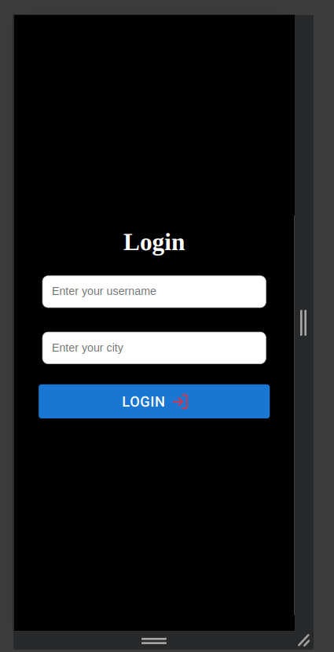
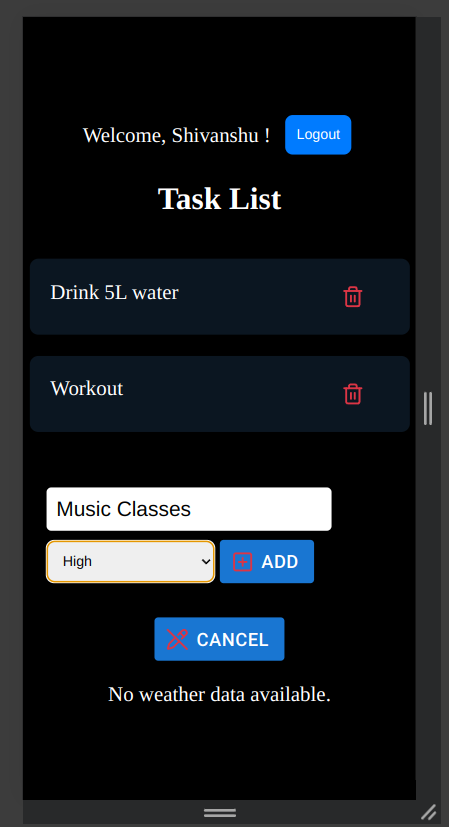
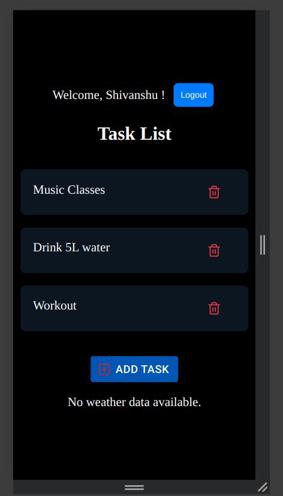
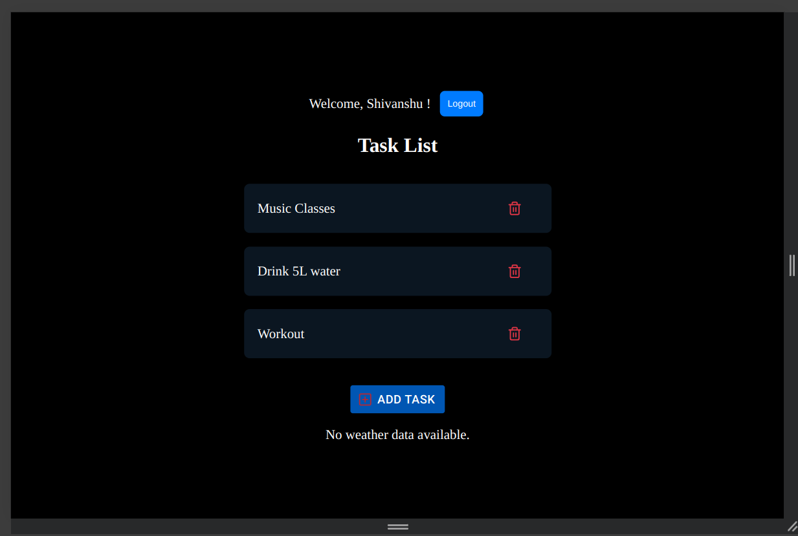

# Weather and To-Do App

A simple web application that combines a weather information app and a task management system using React, Redux Toolkit, and the OpenWeather API.

## 🧑‍💻 Features

-   **Weather Information:** Search for weather data using the OpenWeather API.
-   **To-Do Management:** Add, delete, and prioritize tasks with a clean interface.
-   **Authentication:** Simple login/logout using Redux state management.
-   **Responsive Design:** Fully responsive using plain CSS.

## 🛠️ Technologies Used

-   React
-   Redux Toolkit
-   Redux Thunk
-   OpenWeather API
-   Material-UI (for buttons)
-   Plain CSS for styling

## 🚀 Setup and Run

1. Clone the repository:

    ```bash
    git clone https://github.com/shivanshuhere/todo_quadB.git
    cd todo_quadB
    ```

2. Install dependencies:

    ```bash
    npm install
    ```

3. Create a `.env` file for your API key:

    ```env
    VITE_OPENWEATHER_API_KEY=your_api_key_here
    ```

4. Run the app:

    ```bash
    npm run dev
    ```

5. Access the app at `http://localhost:5173`
    ### Live on Netlify : [Todo](https://todoappq.netlify.app/)

## 📸 Screenshots

| Feature         | Screenshot                                     |
| --------------- | ---------------------------------------------- |
| User Auth       |        |
| Task Management |                |
| Mobile View     |    |
| Desktop View    |  |


